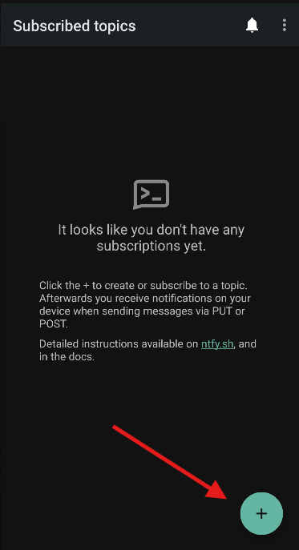
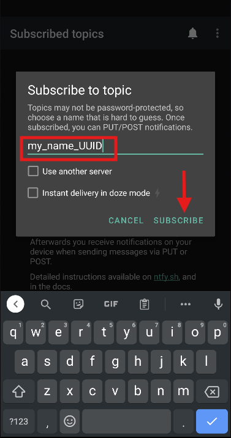

# Welcome to TapApp!

Want to impress her for valentines? I got you. I've created the perfect mini-gift you can give to her and you can pretend that you made it :)

This is a simple application, where you can send a little message to her as a notification once you click your app and vice versa.


# NTFY version

* Currently only works on **android devices**. React Native version will be released soon for cross platform including IOS.
* NTFY is a 3rd party app that will help you send push notifications. This needs to be installed on both you and your partner's phones. Download on the Google Playstore using this link : https://play.google.com/store/apps/details?id=io.heckel.ntfy&pcampaignid=web_share

## Setting up NTFY

1. Install the NTFY app using the link above.
2. Click the + button at the bottom to add topics. 
3. Enter a topic name to subscribe, this can be anything, but make sure to make it unique since these are all public topics. It is recommended to have something like your_name followed by a UUID.


4. Repeat this process on your partner's phone with a **different** topic name, make it unique as before. Now we can proceed with the implmentation. 


## How it works

A simple system is used to send notifications.
1. The app is installed differently on your and your partners devices. We will discuss that next in the application implementation.
2. NTFY is a HTTP-based pub-sub notification service. It allows you to send notifications to your phone or desktop via scripts from any computer, and/or using a REST API.
3. Your app is designed to send the API call to the NTFY topic subscribed by your partner and vice versa. The Notification message is modified from the app.

## Android Version

Once you have completed setting up the NTFY app on both you and your partner's phones, let's proceed with the app implemenation.
Make sure to have android studio installed.
To install the application on your phones, either use USB debugging, or export the app as a .apk file.
But first, we need to configure the topic to be used by the API depending on the phone.

1. Open the MainActivity.kt in the ```app\src\main\java\com\example\tapapp\MainActivity.kt``` directory.
2. In the ```sendNtfyNotification()```, add your topics as follows

```
val success = withContext(Dispatchers.IO) {
    sendNotification(
        // topic = "your_subscribed_topic",
        // topic = "your_partners subscribed_topic",
        title = emojiTitle,
        message = messageContent,
        priority = "default"
    )
}
```

3. Now, when installing on your phone, make sure to uncomment the topic you partner subscribed to. So when you click the button, they get the message and not you.
4. Do the same on your partners phone.  
5. Finally, feel free to change the notification content from the list off messages to whatever cheesy and nerdy pickup line you came up with.
```
private val loveMessages = listOf(
        "❤️ Thinking about you 💕",
        "💖 Missing you right now .....,
```

## Installing the App

There are 2 options, USB Debugging, or sharing the APK.

This article explains in detail the process : https://medium.com/@ybimsara03/usb-debugging-on-android-studio-73e585ea647e

Read it and leave a follow :)